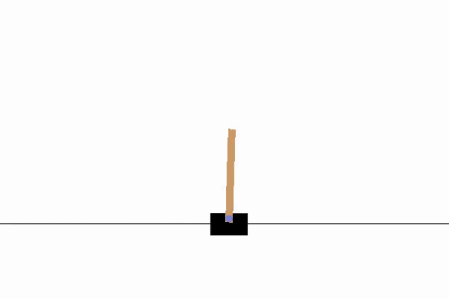

# Solving the Cart Pole problem with vanilla policy gradient algorithm

CartPole is a 2D playing environment of the [gym Python library](https://github.com/openai/gym) from OpenAI. The games provided by `gym` have a special feature: you can interact with the playing environment by command line. Therefore, by using a terminal, you can get the status of the environment, make your action and evaluate the new status of the environment, then take another action, and so on until the game termination.

To get started with `gym`, please inspect the [official page](https://www.gymlibrary.dev/). Moreover, you can find a good tutorial [here](https://blog.paperspace.com/getting-started-with-openai-gym/).

## The cart pole problem

[CartPole](https://www.gymlibrary.dev/environments/classic_control/cart_pole/) is a task requiring moving a cart in two directions (left or right) to keep a pole balanced, similarly to when you try to balance a pen using your fingertip or a cane in your hand.

CartPole is included into the [classic control](https://www.gymlibrary.dev/environments/classic_control/) environment framework. At each action step, the environment returns a reward, which is a value representing the goodness of the action taken. Using reinforcement learning methods, you can program an **artificial agent** to make decisions about moves, until the end of the task.

The animated image below renders a playing round performed by the reinforcement learning agent implemented in this repository.



According to the game rules, the play is solved when the total reward of an episode is at least equal to 200. At each successful action, the environment recognizes a reward of 1. The session closes when the pole falls or a reward of 500 is obtained.

## Content of this repository

The script `CartPole.py` contains a Python class (`Agent`) that implements an agent driving the lander, which uses a vanilla policy gradient method to make decisions about actions. The `cache` stores a backup of a trained agent ready to use (see the notes in the notebook `main.ipynb`). This agent solves about the 93% of episodes with a median reward of 500 (the maximum).

## The Agent class

The `Agent` class requires four kinds of parameters for initialization.

The policy network comes from the argument `model` as a class inheriting from `torch.nn.Module`. By default, the network has one dense layer of size 180 with ReLU activation function. The inputs are the observations from the environment (4 values), while the outputs are the probabilities associated with each possible action (2 values).

Model parameters are optimized by the Adam algorithm with a learning rate `lr=0.0009`.

The rewards obtained during an episode are discounted for a `gamma=0.99` as they move away from the first action of the episode.

## Playing with the agent

```
# Import packages
import gym
import pickle
import CartPole as cp

# Define the environment
env = gym.make('CartPole-v1')

# Load the trained agent from the cache
with open('cache/agent.pickle', 'rb') as file:
    agent = pickle.load(file)

# Play an episode
cp.play(env, agent, render=True, sleep=0.01)
```
